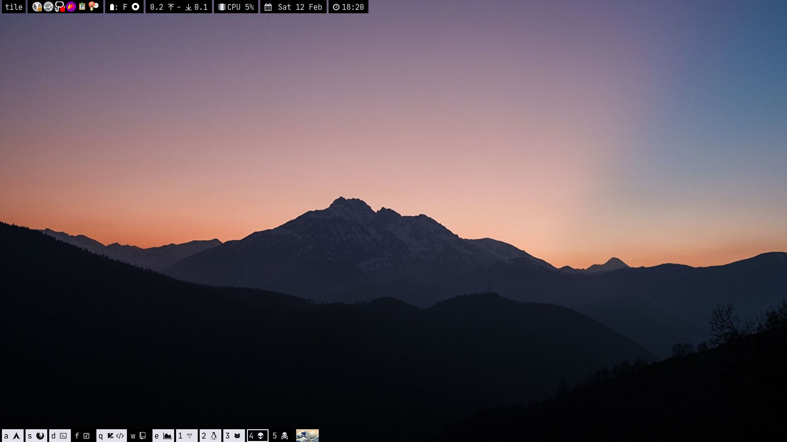
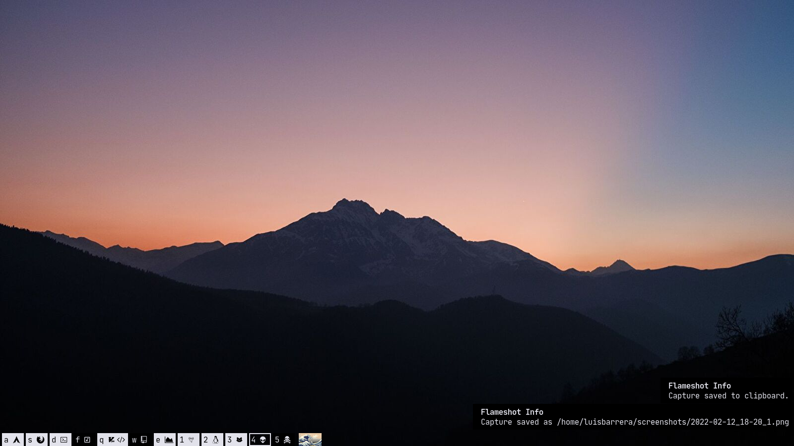
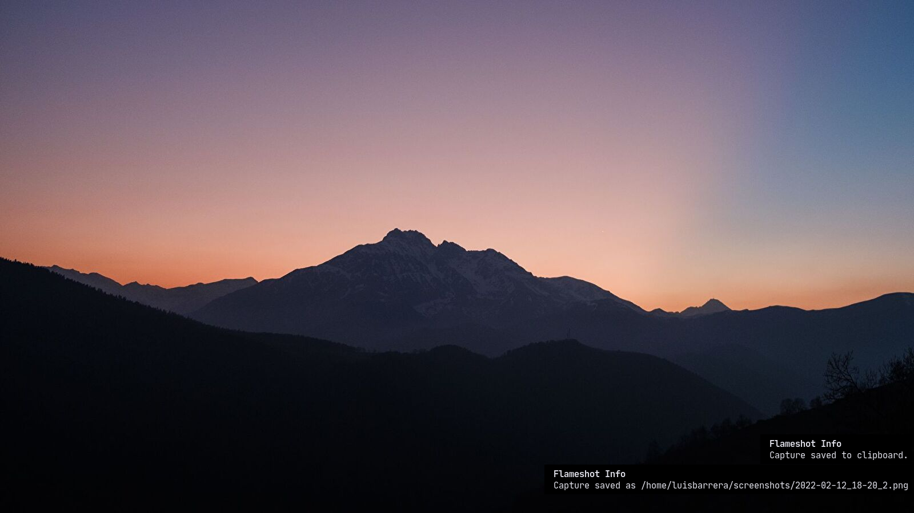
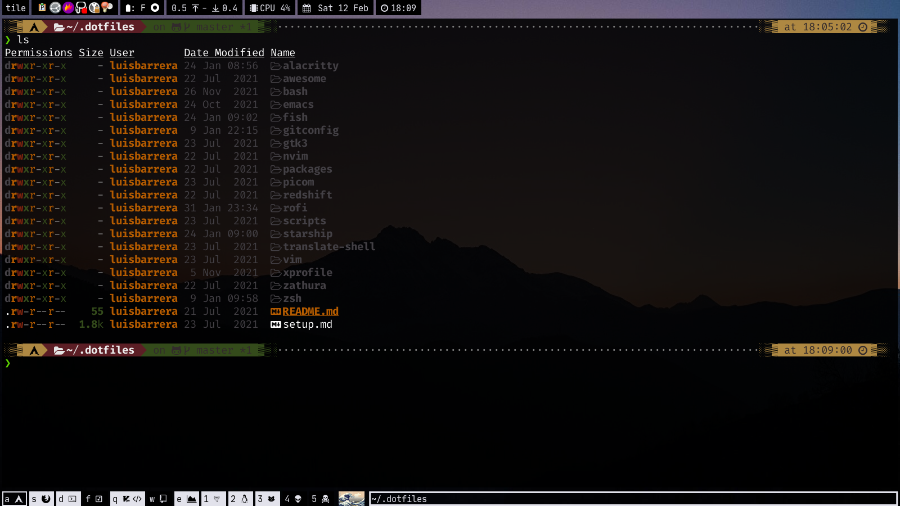
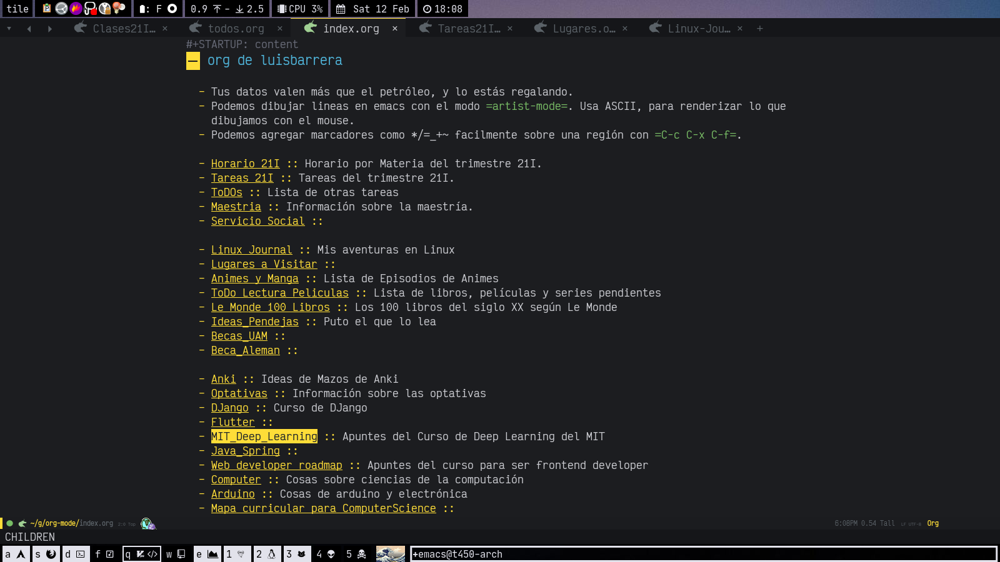

# Linux Dotfiles
----

## Info

- SO: Arch Linux
- WM: AwesomeWM

## Screenshots

### Pantalla principal

### Sin barra superior

### Sin barra superior ni inferior

### Terminal

### Fetch + Vim

### Emacs

